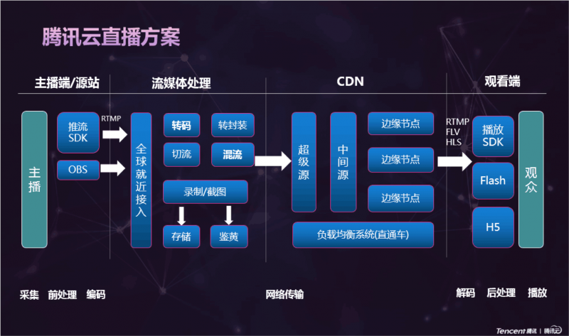
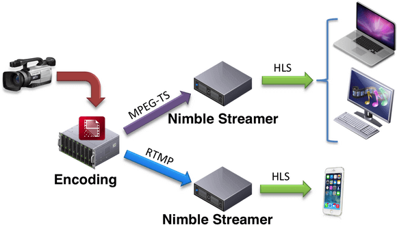
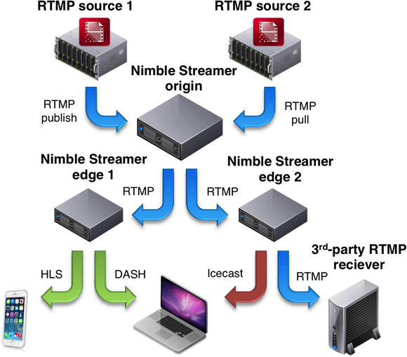

# NGINX MPEG-TS Live Module & Dash JS
## 目录
* 直播流程  
* 流媒体直播功能   
* WEB 直播技术  
  * RTSP 协议   
  * RTMP 协议    
  * HLS 协议   
  * HLS 与 RTMP 对比    
* 环境搭建  
* NGINX-RTMP-TS-DASH 直播方案   
* HTML5 标准  
* HLS 标准  
* WebRTC 标准  
* 参考资料  

###  直播流程

+ 视频直播：采集、前处理、编码、传输、解码、渲染    

+ 采集： 一般是由客户端（IOS、安卓、PC或其它工具，如OBS）完成的，iOS是比较简单的，Android则要做些机型适配工作，PC最麻烦各种奇葩摄像头驱动。 

+ 前期处理： 主要是处理直播美颜，美颜算法需要用到GPU编程，需要懂图像处理算法的人，没有好的开源实现，要自己参考论文去研究。难点不在于美颜效果，而在于GPU占用和美颜效果之间找平衡。  

+ 编码： 要采用硬编码，软编码720p完全没希望，勉强能编码也会导致CPU过热烫到摄像头。编码要在分辨率，帧率，码率，GOP等参数设计上找到最佳平衡点。  

+ 传输： 一般交给了CDN服务商，如：阿里云、腾讯云。  

+ 解码： 是对之前编码的操作，进行解码，在 web 里需要解码是hls。  

+ 渲染： 主要用播放器来解决，web中常用到的播放器有video.js，更多：[html5-dash-hls-rtmp](https://github.com/Tinywan/html5-dash-hls-rtmp)  

+ 下面是腾讯云直播方案的整个流程图：  

  

###  流媒体直播功能

+   支持的直播流输入协议是

    +   RTMP 用于拉取和发布的流
    +   RTSP 为拉和宣布的流
    +   用于HTTP和UDP流的 MPEG-TS
    +   SRT 用于听，拉和集合模式
    +   UDT 用于听，拉和集合模式
    +   HLS 为拉流

+   单路路实时编码流传递（RTMP）



+   多路实时编码流传递（RTMP）



### 环境搭建
+   服务与模块
    +   1、Openresty下载 

        ```bash
        https://openresty.org/download/openresty-1.11.2.3.tar.gz
        ```
    +   2、nginx-ts-module下载 

        ```bash
        git clone https://github.com/arut/nginx-ts-module.git
        ```          

    +   3、ffmpeg 下载安装
    
+   动态编译安装

    +   1、Openresty环境配置
    
        ```bash
        apt-get install libreadline-dev libncurses5-dev libpcre3-dev \
        libssl-dev perl make build-essential
        ```
    +   2、动态编译安装

        ```bash
        ./configure --prefix=/opt/openresty --with-luajit --without-http_redis2_module \
        --with-http_iconv_module --add-dynamic-module=/root/nginx-ts-module
        ...
        make -j4
        ...
        sudo make install
        ```

    +   3、配置文件
        +   `nginx.conf`

            ```bash
            # vim /opt/openresty/nginx/conf/nginx.conf
            error_log  logs/error.log;
            
            pid        logs/nginx.pid;
            
            load_module "/opt/openresty/nginx/modules/ngx_http_ts_module.so"; # 加载模块
            
            events {
            }
            
            http {
                server {
                    listen 8000;
            
                    location / {
                        root html;
                    }
            
                    location /publish/ {
                        ts;
                        ts_hls path=/var/media/hls segment=10s;
                        ts_dash path=/var/media/dash segment=10s;
            
                        client_max_body_size 0;
                    }
            
                    location /play/ {
                        add_header Cache-Control no-cache;
                        add_header 'Access-Control-Allow-Origin' '*' always;
                        add_header 'Access-Control-Expose-Headers' 'Content-Length,Content-Range';
                        add_header 'Access-Control-Allow-Headers' 'Range';
            
                        types {
                            application/x-mpegURL m3u8;
                            application/dash+xml mpd;
                            video/MP2T ts;
                            video/mp4 mp4;
                        }
                        alias /var/media/;
                    }
                }
            }
            ```
        +   流媒体存放文件夹建立
        
			```bash
            cd /var & makedir media
            cd media & makedir hls & makedir dash
			```
    +   4、FFmpeg推流
				
        ```bash
        ffmpeg -re -i rtmp://live.hkstv.hk.lxdns.com/live/hks -bsf:v h264_mp4toannexb \
        -c copy -f mpegts http://127.0.0.1:8000/publish/sintel
        ```

    +   5、客户端播放

        ```html
        <script src="http://cdn.dashjs.org/latest/dash.all.min.js"></script>
        <style>
            video {
                width: 640px;
                height: 360px;
            }
        </style>
        <div>
            <video data-dashjs-player autoplay src="http://1127.0.0.1:8000/play/dash/sintel/index.mpd" 
                controls></video>
        </div>
        ```

    +   6、如果不使用 ffmpeg 直接拉流到`http://127.0.0.1:8000/publish/sintel` 服务的解决方案？ 
        +   （1）nginx-rtmp-module下载 

            git clone https://github.com/arut/nginx-rtmp-module.git

        +   （2）和安装`nginx-ts-module`模块一样动态编译安装既可以，最后别忘记了的在配置文件load `nginx-rtmp-module.so`文件
        +   （3）按照这个顺序：`OBS => nginx-rtmp => nginx-ts`推流，OBS也可以是别的网络推流设备
        +   （4）通过以上我们可以不直接使用ffmpeg 去推流了，而是在Windows端口可以通过OBS很简单的去推流了
        +   （5）使用VLC播放器测试，结果OK!
    +   7、总结，一切顺利通过。   

+   通过SSL加密和公开HLS媒体的来源（HLS）

       

###  NGINX-RTMP-TS-DASH 直播方案

+   HLS、MPEG-DASH多路输入/输出流（HLS、MPEG-DASH）


+   编译安装
    +   1、下载nginx-rtmp-module模块：

        ```bash
        git clone https://github.com/arut/nginx-rtmp-module.git
        ```
    +   2、配置 --with-http_xslt_module 时提示 the HTTP XSLT module requires the libxml2/libxslt libraries，安装以下：
      ​      
        ```bash
        sudo apt-get install libxml2 libxml2-dev libxslt-dev
        sudo apt-get install libgd2-xpm libgd2-xpm-dev
        ```
    +   3、通过configure命令生成Makefile文件，为下一步的编译做准备：

        ```bash
        ./configure --prefix=/opt/openresty --with-luajit --without-http_redis2_module --with-http_iconv_module \ 
        --with-http_stub_status_module --with-http_xslt_module --add-dynamic-module=/root/nginx-ts-module \
        --add-dynamic-module=/root/nginx-rtmp-module
        ```
    +   4、如果报下面的错误

        ```bash
        platform: linux (linux)
            you need to have ldconfig in your PATH env when enabling luajit.
        ```
         > 是因为找不到命令ldconfig, 这个命令一般是在/sbin/目录下的，所以先执行`export PATH=$PATH:/sbin`
            
    +   5、如果出现：`./configure: error: the HTTP XSLT module requires the libxml2/libxslt` 错误，安装以下：
    
        ```bash
        sudo apt-get install libxml2 libxml2-dev libxslt-dev
        ```

+   `nginx.conf` 配置

    ```bash
    # vim /opt/openresty/nginx/conf/nginx.conf
    user  www;
    worker_processes  1;

    error_log  logs/error.log;

    pid        logs/nginx.pid;

    load_module "/opt/openresty/nginx/modules/ngx_http_ts_module.so";
    load_module "/opt/openresty/nginx/modules/ngx_rtmp_module.so";

    events {
        worker_connections  1024;
    }
     
     http {
         server {
             listen 8000;
     
             # This URL provides RTMP statistics in XML
             location /stat {
                rtmp_stat all;
                rtmp_stat_stylesheet stat.xsl;
             }
     
             location /stat.xsl {
                root html;
             }
     
             location /hls {
                 # Serve HLS fragments
                add_header Cache-Control no-cache;
                add_header 'Access-Control-Allow-Origin' '*' always;
                add_header 'Access-Control-Expose-Headers' 'Content-Length,Content-Range';
                add_header 'Access-Control-Allow-Headers' 'Range';
            
                types {
                    application/vnd.apple.mpegurl m3u8;
                    video/mp2t ts;
                }
            
                root /tmp;
             }

             location /dash {
                 # Serve DASH fragments
                 add_header Cache-Control no-cache;
                 add_header 'Access-Control-Allow-Origin' '*' always;
                 add_header 'Access-Control-Expose-Headers' 'Content-Length,Content-Range';
                 add_header 'Access-Control-Allow-Headers' 'Range';
     
                 types {
                     application/dash+xml mpd;
                     video/mp4 mp4;
                 }

                 root /tmp;
             }
         }
     }

     rtmp {
         listen 1935;
         chunk_size 4000;
         idle_streams off;
         ping 30s;
         notify_method get;

         server {
             listen 1935;
             chunk_size 4000;
     
             drop_idle_publisher 10s;
             idle_streams off;
            
             application live {
                 live on;
             }
     
             application hls {
                 live on;
                 hls on;
                 hls_path /tmp/hls;
             }
     
             # MPEG-DASH is similar to HLS
             application dash {
                 live on;
                 dash on;
                 dash_path /tmp/dash;
             }
         }
     }
    ```

+   拷贝xml文件：`cp /root/nginx-rtmp-module/stat.xsl /opt/openresty/nginx/html`    
+   流状态查看：`http://127.0.0.1:8000/stat`    
+   OBS推流地址：`rtmp://127.0.0.1/dash/123`    
+   VLC观看RTMP直播流：`rtmp://127.0.0.1/dash/123`    
+   DASH格式HTTP播放

    ```html
    <script src="http://cdn.dashjs.org/latest/dash.all.min.js"></script>
    <style>
        video {
            width: 640px;
            height: 360px;
        }
    </style>
    <div>
        <video data-dashjs-player autoplay src="http://127.0.0.1:8000/dash/123.mpd" controls></video>
    </div>
    ```

+   结束    

## [HLS 协议标准](https://link.jianshu.com/?t=http://tools.ietf.org/html/draft-pantos-http-live-streaming)

## 参考资料
+ [FFmpeg功能命令集合](https://www.jianshu.com/p/053665062f22)
+ [ffmpeg处理RTMP流媒体的命令大全(http://blog.csdn.net/leixiaohua1020/article/details/12029543)
+ [FFmpeg常用推流命令](https://www.jianshu.com/p/d541b317f71c)
+ [HTTP Live Streaming (HLS) - 概念](https://www.jianshu.com/p/2ce402a485ca)
+ [HLS-iOS视频播放服务架构深入探究（一）](https://yangchao0033.github.io/blog/2016/01/29/hls-1/)
+ [HLS-iOS视频播放服务架构深入探究（二）](https://yangchao0033.github.io/blog/2016/02/14/hls-2/)

